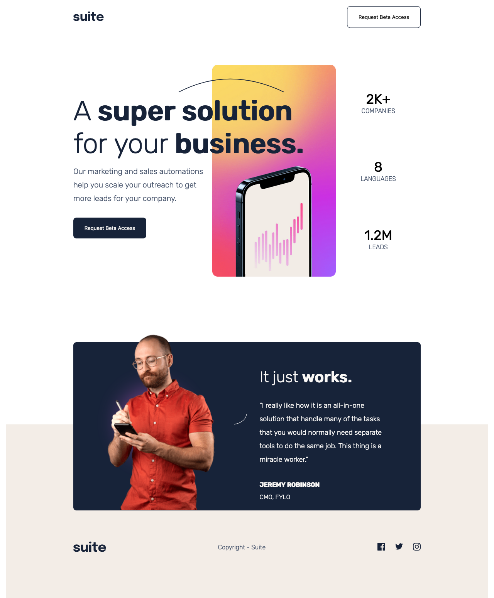

# Frontend Mentor - Suite landing page solution

This is a solution to the [Suite landing page challenge on Frontend Mentor](https://www.frontendmentor.io/challenges/suite-landing-page-tj_eaU-Ra). Frontend Mentor challenges help you improve your coding skills by building realistic projects.

## Table of contents

- [Overview](#overview)
  - [The challenge](#the-challenge)
  - [Screenshot](#screenshot)
  - [Links](#links)
- [My process](#my-process)
  - [Built with](#built-with)
- [Author](#author)

## Overview

### The challenge

Users should be able to:

- View the optimal layout depending on their device's screen size
- See hover states for interactive elements

### Screenshot

### Links

- Solution URL: [Solution](https://www.frontendmentor.io/solutions/mobilefirst-approach-with-flexbox-nuor9gbUY)
- Live Site URL: [suite-landing.netlify.app](https://suite-landing.netlify.app/)

## My process

### Built with

- Semantic HTML5 markup
- CSS custom properties
- Flexbox
- Mobile-first workflow

## Author

- Website - [sheelovedol.com](https://www.sheelovedol.com)
- Frontend Mentor - [SudZero848](https://www.frontendmentor.io/profile/SudZero848)

